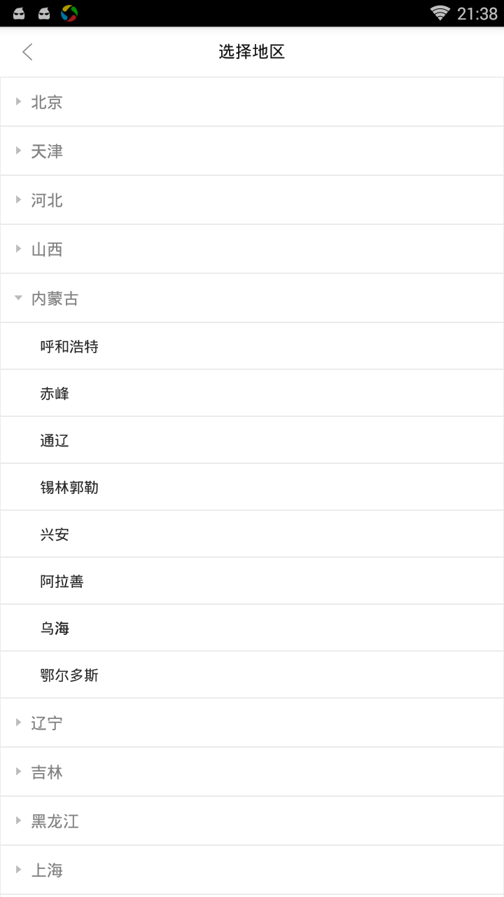

# Android-ChineseAdministrativeDivisions
中国的行政区域数据,数据来源是：<a href="http://www.stats.gov.cn/tjsj/tjbz/tjyqhdmhcxhfdm/" target=_blank>中华人民共和国统计局-统计用区划和城乡划分代码</a>

## 效果图


## 依赖方法
在要使用的模块中的<code>build.gradle</code>或者<code>build.gradle.kts</code>配置脚本中的依赖中加入如下：
```
api("com.fpliu:Android-ChineseAdministrativeDivisions:1.0.0")
```
## 使用方法
这里只提供kotlin版本的使用方法，Java语言类似：
```
import android.app.Activity
import android.content.Intent
import android.os.Bundle
import com.fpliu.newton.chinese_administrative_divisions.AddressSelectActivity
import com.fpliu.newton.ui.base.BaseActivity
import com.fpliu.newton.ui.base.BaseUIConfig
import kotlinx.android.synthetic.main.activity_main.*

class MainActivity : BaseActivity() {

    companion object {
        private const val REQUEST_CODE_SELECT_ADDRESS = 100
    }

    override fun onCreate(savedInstanceState: Bundle?) {
        super.onCreate(savedInstanceState)
        setContentView(R.layout.activity_main)
        click(buttom).subscribe { AddressSelectActivity.startForResult(this, REQUEST_CODE_SELECT_ADDRESS) }
    }

    override fun onActivityResult(requestCode: Int, resultCode: Int, data: Intent?) {
        super.onActivityResult(requestCode, resultCode, data)
        if (requestCode == REQUEST_CODE_SELECT_ADDRESS && resultCode == Activity.RESULT_OK && data != null) {
            val provinceName = data.getStringExtra(AddressSelectActivity.KEY_RESULT_PROVINCE_NAME)
            val cityName = data.getStringExtra(AddressSelectActivity.KEY_RESULT_CITY_NAME)
            showToast("$provinceName , $cityName")
        }
    }
}
```
